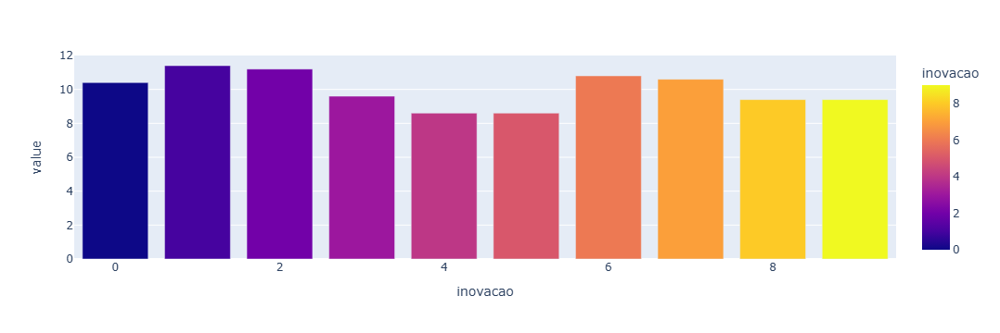
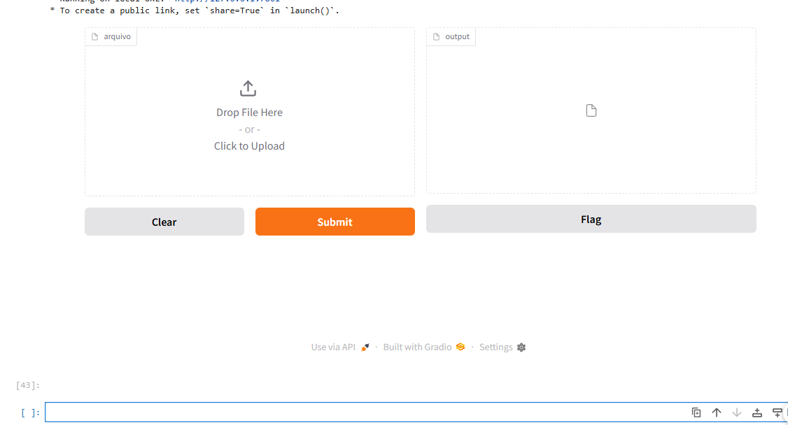

# Corporate Client Classifier - AI Credit Segmentation

<div align="left">
  
  
  
  
  
  <br><br>
   
   [🌍 Read in English](./README.md) | [🇧🇷 Leia em Português](./README-pt.md)
</div>

This Machine Learning project aims to classify corporate clients (B2B) of a credit company into different segments (**Starter, Bronze, Silver, and Gold**). The classification assists in strategic decision-making and the personalized offering of financial products.

The project covers everything from Exploratory Data Analysis (EDA) to the deployment of an interactive interface for batch prediction.

## Project Structure

The main files in the repository are:

* `classificacao_segmento_empresa.ipynb`: The "core" of the project. A Jupyter Notebook containing:
    * Exploratory Data Analysis (EDA) with charts (Plotly/Matplotlib).
    * Data preprocessing (Pipeline, Imputation, OneHotEncoding).
    * Model training (Decision Tree Classifier).
    * Hyperparameter optimization with **Optuna**.
    * Creation of a **Gradio** interface for model usage.
* `dataset_segmentos_clientes.csv`: Historical database used to train and validate the model.
* `novas_empresas.csv`: Example file containing new clients to test the model's predictions.
* `modelo_classificacao_decision_tree.pkl`: The trained and serialized (saved) model ready for use.
* `Pipfile` & `Pipfile.lock`: Dependency management files (Pipenv virtual environment).
* `README.md`: Project documentation.

## Technologies Used

The project was developed in **Python 3.13**, using the **Pipenv** package manager. The main libraries are:

* **Data Manipulation:** `pandas`, `numpy`
* **Visualization:** `matplotlib`, `plotly`, `pingouin`
* **Machine Learning:** `scikit-learn` (Decision Tree, Pipelines, Cross-Validation)
* **Optimization:** `optuna` (Hyperparameter fine-tuning)
* **Interface/Deployment:** `gradio` (Web App creation for CSV upload)
* **Serialization:** `joblib`

## 📊 Data Dictionary

The variables used to classify the companies are:

| Variable | Type | Description |
| :--- | :--- | :--- |
| `atividade_economica` | Categorical | Business sector (e.g., Commerce, Industry, Services, Agribusiness). |
| `faturamento_mensal` | Numerical | Average monthly revenue of the company. |
| `numero_de_funcionarios` | Numerical | Total number of employees. |
| `localizacao` | Categorical | Headquarters city/state (e.g., São Paulo, Rio de Janeiro). |
| `idade` | Numerical | Company age (in years). |
| `inovacao` | Numerical | Internal innovation index (score). |
| **`segmento_de_cliente`** | **Target** | The final classification: **Starter, Bronze, Silver, Gold**. |

## How to Run the Project

### Prerequisites
* Python 3.13+
* Pipenv (Package manager)

### Step-by-Step Guide
1. Clone the repository:
   ```bash
   git clone [https://github.com/danilotavares-dev/classificador-clientes-IA.git](https://github.com/danilotavares-dev/classificador-clientes-IA.git)
   cd nome-do-repo
   ```

2. Install dependencies:
    ```bash
    pip install pipenv
    pipenv  install
    ```
3. Run the Notebook or Interface: To run the Gradio interface directly:
    * Open the classificacao_segmento_empresa.ipynb file in Jupyter Notebook and run all cells to start the Gradio interface at the end.

## Results and Insights

During the Exploratory Analysis and modeling, the project faced the challenge of an imbalanced dataset, a common scenario in credit risk.

### Technical Performance
* **Global Accuracy:** The model (Decision Tree) achieved ~47% in cross-validation.
* **Optimization (Optuna):** The best configuration found was `min_samples_leaf: 4` and `max_depth: 2`.

### Business Analysis
* **Decisive Factor:** The Chi-Square test confirmed that the `inovacao` (innovation) variable is the biggest discriminator. Innovative companies lean strongly towards the 'Gold' or 'Silver' segments.
* **Limitations:** The model performs well in the majority class ('Silver') but confuses adjacent segments (e.g., Bronze with Silver) due to overlapping revenue.

## Next Steps
To improve the classifier's performance in future versions:

* Test Ensemble algorithms (such as Random Forest or Gradient Boosting) to try and surpass the simple Decision Tree accuracy.
* Perform Feature Engineering to create new variables that may have greater predictive power.
* Balance the dataset classes, since there is a disproportion between the segments (e.g., many 'Silver' and few 'Gold').

## Project Gallery

### 1. Data Analysis (EDA)
As described in the insights, the Innovation variable proved to be the biggest watershed between segments. The chart below illustrates this correlation:



### 2. Application in Operation
The project features a Gradio interface to facilitate use by business teams. Simply upload the spreadsheet of new clients:


